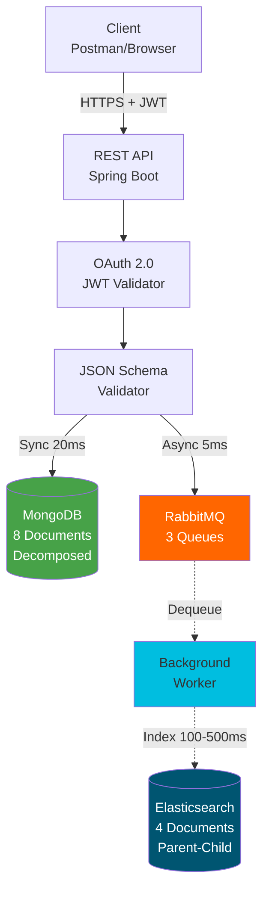
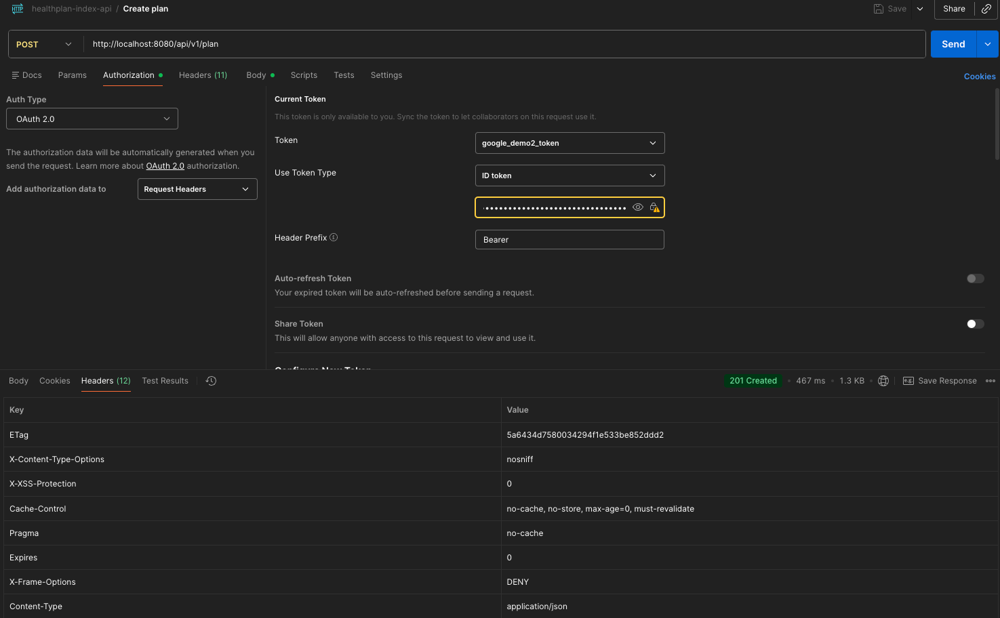

# 🏥 HealthPlan Index API

> Distributed medical insurance plan management system with real-time indexing and advanced search capabilities

[](https://www.oracle.com/java/)
[](https://spring.io/projects/spring-boot)
[](https://www.mongodb.com/)
[](https://www.elastic.co/)
[](https://www.rabbitmq.com/)

---

## 📋 Table of Contents

- [What I Built](#-what-i-built)
- [Key Features](#-key-features)
- [System Architecture](#️-system-architecture)
- [Tech Stack](#️-tech-stack)
- [Quick Start](#-quick-start)
- [OAuth 2.0 Setup](#-oauth-20-setup)
- [API Endpoints](#-api-endpoints)
- [Parent-Child Indexing](#-parent-child-indexing)
- [Sample Data](#-sample-data)
- [Project Structure](#-project-structure)
- [Design Rationale](#-design-rationale)

---

## 🎯 What I Built

<table>
<tr>
<td width="50%">

### Backend Architecture
- ✅ **RESTful API Design** - Spring Boot with comprehensive CRUD operations
- ✅ **Decomposed Storage** - 8-document MongoDB architecture for flexibility
- ✅ **Advanced Indexing** - Elasticsearch Parent-Child relationships
- ✅ **Message-Driven Architecture** - RabbitMQ for async processing
- ✅ **JSON Schema Validation** - Contract-first API design

</td>
<td width="50%">

### Security & Performance
- ✅ **OAuth 2.0 Integration** - Google JWT token validation
- ✅ **Optimistic Concurrency** - ETag-based conflict prevention
- ✅ **Sub-30ms Response** - Queue-based performance optimization
- ✅ **Auto-Initialization** - Self-configuring Elasticsearch mappings
- ✅ **Data Consistency** - Synchronized dual-storage system

</td>
</tr>
</table>

---

## ⚡ Key Features

<div align="center">

| 🚀 Dual Storage | 🔄 Async Processing | 🌳 Parent-Child | 🔒 Enterprise Security |
|:---------------:|:-------------------:|:---------------:|:----------------------:|
| MongoDB (fast) + Elasticsearch (searchable) | 25ms API response via RabbitMQ | Complex queries without JOIN | OAuth 2.0 + JSON Schema |

</div>

---

## 🏗️ System Architecture



**Data Flow:** Client → API → MongoDB (instant) → Queue → Worker → Elasticsearch (background)

**Result:** Fast user experience (~25ms) with powerful search capabilities

---

## 🛠️ Tech Stack

| Component | Technology | Version | Purpose |
|-----------|-----------|---------|---------|
| Framework | Spring Boot | 3.5.6 | REST API, Dependency Injection, Auto-configuration |
| Language | Java | 21 | Application development |
| Primary DB | MongoDB | 8.0 | Fast K-V storage with document decomposition |
| Search Engine | Elasticsearch | 8.11 | Full-text search, Parent-Child indexing |
| Message Queue | RabbitMQ | 3.12 | Async processing, decoupling |
| Security | Spring Security + OAuth 2.0 | - | Google JWT validation |
| Validation | JSON Schema Validator | 2.2.14 | Contract validation |
| Containerization | Docker Compose | - | Service orchestration |

---

## 🚀 Quick Start

### Prerequisites
- Java 21+
- Docker & Docker Compose
- Maven (or use `./mvnw`)

### 1. Start Infrastructure

```bash
docker-compose up -d
```

### 2. Run Application

```bash
./mvnw spring-boot:run
```

### 3. Test API

**Get OAuth token** (see [OAuth 2.0 Setup](#-oauth-20-setup)), then:

```bash
curl -X POST http://localhost:8080/api/v1/plan \
  -H "Content-Type: application/json" \
  -H "Authorization: Bearer YOUR_TOKEN" \
  -d '{
    "objectId": "plan-001",
    "objectType": "plan",
    "_org": "example.com",
    "planType": "inNetwork",
    "creationDate": "2025-12-06",
    "planCostShares": {
      "deductible": 2000,
      "copay": 23,
      "objectId": "costshare-001",
      "objectType": "membercostshare",
      "_org": "example.com"
    },
    "linkedPlanServices": [...]
  }'
```

**Verify storage:**
```bash
# MongoDB (8 documents - decomposed)
docker exec -it healthplan-mongodb mongosh healthplandb \
  --eval "db.plans.countDocuments()"

# Elasticsearch (4 documents - parent-child)
curl http://localhost:9200/plans/_count
```

---

## 🔐 OAuth 2.0 Setup

### Google OAuth Configuration

1. **Create OAuth Client**
   - Go to [Google Cloud Console](https://console.cloud.google.com/)
   - **APIs & Services** → **Credentials** → **Create OAuth 2.0 Client ID**
   - Add redirect URI: `https://oauth.pstmn.io/v1/callback`

2. **Postman Configuration**
   
   | Field | Value |
   |-------|-------|
   | **Type** | OAuth 2.0 |
   | **Grant Type** | Implicit |
   | **Auth URL** | `https://accounts.google.com/o/oauth2/v2/auth` |
   | **Client ID** | Your Google Client ID |
   | **Scope** | `openid email profile` |
   
   
   
4. **Get Token** → Authenticate → **Use Token**

---

## 📡 API Endpoints

| Method | Endpoint | Description | Headers |
|--------|----------|-------------|---------|
| POST | `/api/v1/plan` | Create plan | `Authorization`, `Content-Type` |
| GET | `/api/v1/plan/{id}` | Retrieve plan | `Authorization`, `If-None-Match` (optional) |
| PATCH | `/api/v1/plan/{id}` | Update plan | `Authorization`, `If-Match`, `Content-Type` |
| DELETE | `/api/v1/plan/{id}` | Delete plan | `Authorization` |

### Response Status Codes

| Code | Meaning |
|------|---------|
| 200 | OK - Request successful |
| 201 | Created - Plan created successfully |
| 204 | No Content - Plan deleted successfully |
| 304 | Not Modified - ETag matched (GET) |
| 400 | Bad Request - Invalid JSON or schema validation failed |
| 401 | Unauthorized - Missing or invalid OAuth token |
| 404 | Not Found - Plan doesn't exist |
| 409 | Conflict - Plan already exists |
| 412 | Precondition Failed - ETag mismatch (PATCH) |

---

## 🔍 Parent-Child Indexing

### What is Parent-Child?

Elasticsearch feature that stores related documents separately while maintaining queryable relationships - ideal for frequently updated data.

### Schema

```
Plan (parent)
  ├─ PlanCostShares (child)
  └─ LinkedPlanServices (children)
```

### Query Examples

#### 1. Find Plans with Free Services (has_child)

```bash
curl -X POST "http://localhost:9200/plans/_search?pretty" \
  -H 'Content-Type: application/json' -d'
{
  "query": {
    "has_child": {
      "type": "linkedPlanService",
      "query": {
        "term": { "planserviceCostShares.copay": 0 }
      }
    }
  }
}
'
```

Returns: **Parent documents** (Plans) that have children matching the query

```bash
{
  "took" : 100,
  "timed_out" : false,
  "_shards" : {
    "total" : 1,
    "successful" : 1,
    "skipped" : 0,
    "failed" : 0
  },
  "hits" : {
    "total" : {
      "value" : 1,
      "relation" : "eq"
    },
    "max_score" : 1.0,
    "hits" : [
      {
        "_index" : "plans",
        "_id" : "demo-final-001",
        "_score" : 1.0,
        "_source" : {
          "planType" : "inNetwork",
          "_org" : "example.com",
          "creationDate" : "12-12-2017",
          "plan_join" : {
            "name" : "plan"
          },
          "objectId" : "demo-final-001",
          "objectType" : "plan"
        }
      }
    ]
  }
}
```

#### 2. Find All Children of a Plan (has_parent)

```bash
curl -X POST "http://localhost:9200/plans/_search?pretty" \
  -H 'Content-Type: application/json' -d'
{
  "query": {
    "has_parent": {
      "parent_type": "plan",
      "query": {
        "match_all": {}
      }
    }
  }
}
'
```

Returns: **Child documents** (PlanCostShares, LinkedPlanServices) of the Plan

```bash
{
  "took" : 32,
  "timed_out" : false,
  "_shards" : {
    "total" : 1,
    "successful" : 1,
    "skipped" : 0,
    "failed" : 0
  },
  "hits" : {
    "total" : {
      "value" : 3,
      "relation" : "eq"
    },
    "max_score" : 1.0,
    "hits" : [
      {
        "_index" : "plans",
        "_id" : "1234vxc2324sdf-501",
        "_score" : 1.0,
        "_routing" : "demo-final-001",
        "_source" : {
          "deductible" : 2000,
          "_org" : "example.com",
          "copay" : 23,
          "plan_join" : {
            "name" : "planCostShares",
            "parent" : "demo-final-001"
          },
          "objectId" : "1234vxc2324sdf-501",
          "objectType" : "membercostshare"
        }
      },
      {
        "_index" : "plans",
        "_id" : "27283xvx9asdff-504",
        "_score" : 1.0,
        "_routing" : "demo-final-001",
        "_source" : {
          "linkedService" : {
            "name" : "Yearly physical",
            "objectId" : "1234520xvc30asdf-502"
          },
          "planserviceCostShares" : {
            "deductible" : 10,
            "copay" : 0
          },
          "_org" : "example.com",
          "plan_join" : {
            "name" : "linkedPlanService",
            "parent" : "demo-final-001"
          },
          "objectId" : "27283xvx9asdff-504",
          "objectType" : "planservice"
        }
      },
      {
        "_index" : "plans",
        "_id" : "27283xvx9sdf-507",
        "_score" : 1.0,
        "_routing" : "demo-final-001",
        "_source" : {
          "linkedService" : {
            "name" : "well baby",
            "objectId" : "1234520xvc30sfs-505"
          },
          "planserviceCostShares" : {
            "deductible" : 10,
            "copay" : 175
          },
          "_org" : "example.com",
          "plan_join" : {
            "name" : "linkedPlanService",
            "parent" : "demo-final-001"
          },
          "objectId" : "27283xvx9sdf-507",
          "objectType" : "planservice"
        }
      }
    ]
  }
}
```

---

## 📄 Sample Data

### Complete Plan JSON

<details>
<summary>Click to expand full Plan JSON example</summary>

```json
{
  "planCostShares": {
    "deductible": 2000,
    "_org": "example.com",
    "copay": 23,
    "objectId": "costshare-001",
    "objectType": "membercostshare"
  },
  "linkedPlanServices": [
    {
      "linkedService": {
        "_org": "example.com",
        "objectId": "service-001",
        "objectType": "service",
        "name": "Yearly physical"
      },
      "planserviceCostShares": {
        "deductible": 10,
        "_org": "example.com",
        "copay": 0,
        "objectId": "pscostshare-001",
        "objectType": "membercostshare"
      },
      "_org": "example.com",
      "objectId": "planservice-001",
      "objectType": "planservice"
    },
    {
      "linkedService": {
        "_org": "example.com",
        "objectId": "service-002",
        "objectType": "service",
        "name": "Well baby"
      },
      "planserviceCostShares": {
        "deductible": 10,
        "_org": "example.com",
        "copay": 175,
        "objectId": "pscostshare-002",
        "objectType": "membercostshare"
      },
      "_org": "example.com",
      "objectId": "planservice-002",
      "objectType": "planservice"
    }
  ],
  "_org": "example.com",
  "objectId": "plan-001",
  "objectType": "plan",
  "planType": "inNetwork",
  "creationDate": "2025-12-06"
}
```

</details>

### Storage Breakdown

**MongoDB (8 documents - fully decomposed):**
```
plans collection:
├─ plan-001 (Plan)
├─ costshare-001 (PlanCostShares, parent: plan-001)
├─ planservice-001 (LinkedPlanService, parent: plan-001)
├─ service-001 (Service, parent: planservice-001)
├─ pscostshare-001 (CostShare, parent: planservice-001)
├─ planservice-002 (LinkedPlanService, parent: plan-001)
├─ service-002 (Service, parent: planservice-002)
└─ pscostshare-002 (CostShare, parent: planservice-002)
```

**Elasticsearch (4 documents - parent-child structure):**
```
plans index:
├─ plan-001 (parent)
├─ costshare-001 (child of plan-001)
├─ planservice-001 (child of plan-001)
└─ planservice-002 (child of plan-001)
```

**View all MongoDB document IDs:**
```bash
docker exec -it healthplan-mongodb mongosh healthplandb \
  --eval "print(db.plans.find({}, {_id: 1}).toArray().map(d => d._id).join(', '))"
```

---

## 📁 Project Structure

```
healthplan-index-api/
├── src/
│   ├── main/
│   │   ├── java/com/healthplan/indexapi/
│   │   │   ├── config/
│   │   │   │   ├── ElasticsearchInitializer.java    # Auto-creates ES mappings on startup
│   │   │   │   ├── RabbitMQConfig.java              # Declares 3 durable queues
│   │   │   │   └── SecurityConfig.java              # OAuth 2.0 filter chain
│   │   │   ├── controller/
│   │   │   │   └── PlanController.java              # REST endpoints (POST/GET/PATCH/DELETE)
│   │   │   ├── exception/
│   │   │   │   ├── GlobalExceptionHandler.java      # Centralized error handling
│   │   │   │   ├── ResourceAlreadyExistsException.java
│   │   │   │   └── ResourceNotFoundException.java
│   │   │   ├── model/
│   │   │   │   ├── PlanEntity.java                  # Generic MongoDB document
│   │   │   │   └── queue/
│   │   │   │       └── PlanQueueMessage.java        # RabbitMQ message model
│   │   │   ├── repository/
│   │   │   │   └── PlanRepository.java              # MongoDB queries (findByParentId, etc.)
│   │   │   ├── security/
│   │   │   │   ├── JwtAuthenticationFilter.java     # Intercepts all requests
│   │   │   │   └── TokenValidator.java              # Validates Google JWT
│   │   │   ├── service/
│   │   │   │   ├── ElasticsearchIndexService.java   # Parent-Child indexing logic
│   │   │   │   ├── PlanService.java                 # Core business logic
│   │   │   │   └── QueueService.java                # RabbitMQ producer
│   │   │   ├── util/
│   │   │   │   └── ETagGenerator.java               # MD5-based ETag generation
│   │   │   ├── validation/
│   │   │   │   └── JsonSchemaValidator.java         # Schema-based validation
│   │   │   ├── worker/
│   │   │   │   └── PlanIndexWorker.java             # RabbitMQ consumer (@RabbitListener)
│   │   │   └── HealthplanIndexApiApplication.java   # Main entry point
│   │   └── resources/
│   │       ├── application.properties                # Configuration
│   │       └── schemas/
│   │           └── plan-schema.json                  # JSON Schema definition
│   └── test/                                         # Unit tests
├── docker-compose.yml                                # Orchestrates MongoDB, ES, RabbitMQ
├── pom.xml                                           # Maven dependencies
└── README.md
```

---

## 💭 Design Rationale

### 1. Why MongoDB + Elasticsearch Dual Storage?

**Problem:** No single database excels at both fast writes AND complex searches

**Solution:**
```
MongoDB: Handles all writes (1-20ms latency)
         ↓ (via RabbitMQ queue)
Elasticsearch: Handles complex searches (async indexing)
```

**Real-world analogy:** Bank account
- MongoDB = ATM withdrawal (must be instant)
- Elasticsearch = Transaction history search (can be slightly delayed)

### 2. Why Decompose into 8 MongoDB Documents?

**Mirrors Elasticsearch structure** for consistency:
- Same parent-child relationships
- Easier debugging (matching objectIds)
- Efficient updates (modify only changed documents)

**Trade-off:** More complex reconstruction logic vs. flexible querying

### 3. Why Parent-Child over Nested Objects?

Medical insurance plans are **frequently updated** (new services, price changes).

| Update Scenario | Nested Objects | Parent-Child (Chosen) |
|----------------|----------------|-----------------------|
| Add new service | Reindex entire Plan | Index only new service ✅ |
| Change service price | Reindex entire Plan | Update only that service ✅ |
| Indexing time | ~500ms | ~100ms ✅ |

---

## 🔗 Useful Commands

### View MongoDB Data

```bash
# List all document IDs (single line)
docker exec -it healthplan-mongodb mongosh healthplandb \
  --eval "print(db.plans.find({}, {_id: 1}).toArray().map(d => d._id).join(', '))"

# View documents with structure
docker exec -it healthplan-mongodb mongosh healthplandb \
  --eval "db.plans.find({}, {_id: 1, objectType: 1, parentId: 1}).pretty()"
```

### View Elasticsearch Data

```bash
# Check document count
curl http://localhost:9200/plans/_count

# View all indexed documents
curl http://localhost:9200/plans/_search?pretty

# Check Parent-Child mapping
curl http://localhost:9200/plans/_mapping?pretty
```

### RabbitMQ Management UI

```
URL: http://localhost:15672
Username: admin
Password: admin123
```


---

## 📚 Resources

- [Elasticsearch Parent-Child Documentation](https://www.elastic.co/guide/en/elasticsearch/reference/current/parent-join.html)
- [Spring AMQP Reference](https://docs.spring.io/spring-amqp/reference/)
- [JSON Schema Specification](https://json-schema.org/)
- [OAuth 2.0 RFC](https://oauth.net/2/)

---

<div align="center">

**Built with Spring Boot, MongoDB, Elasticsearch, and RabbitMQ**

⭐ If you find this project interesting, consider giving it a star!

</div>
